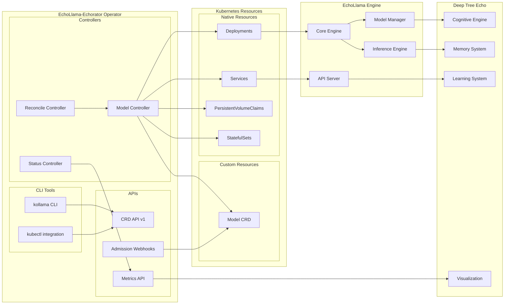
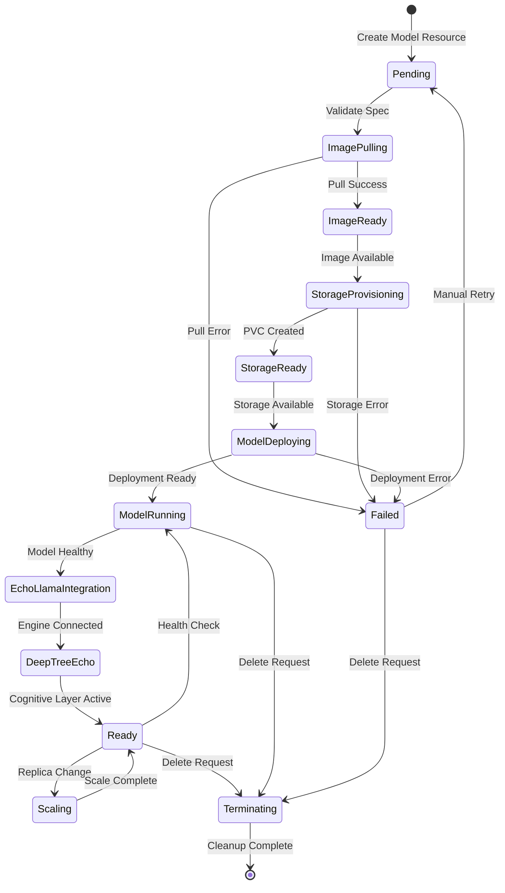
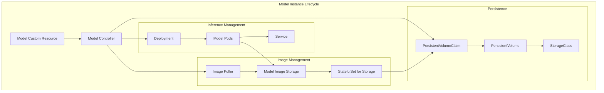
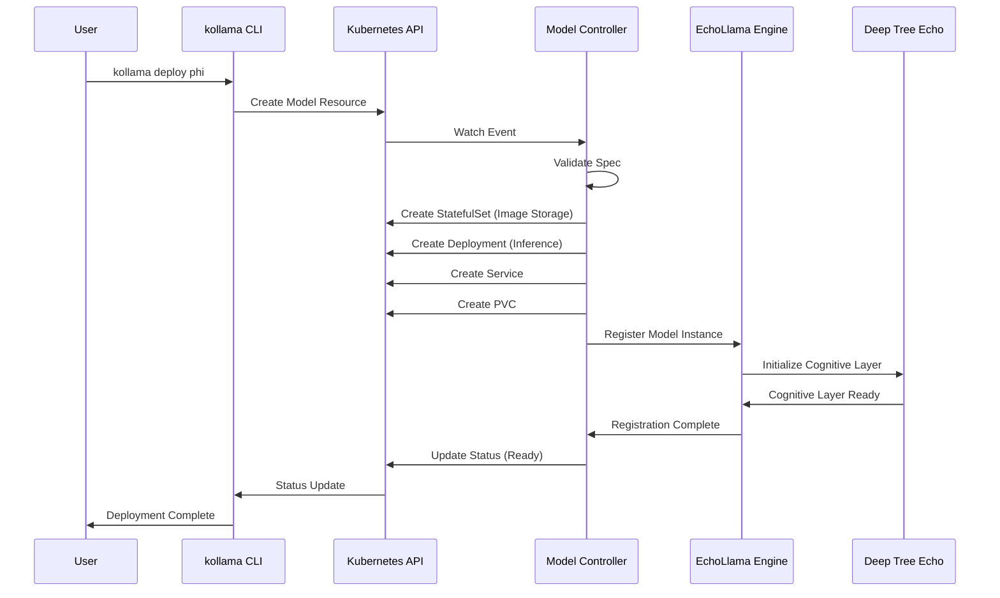
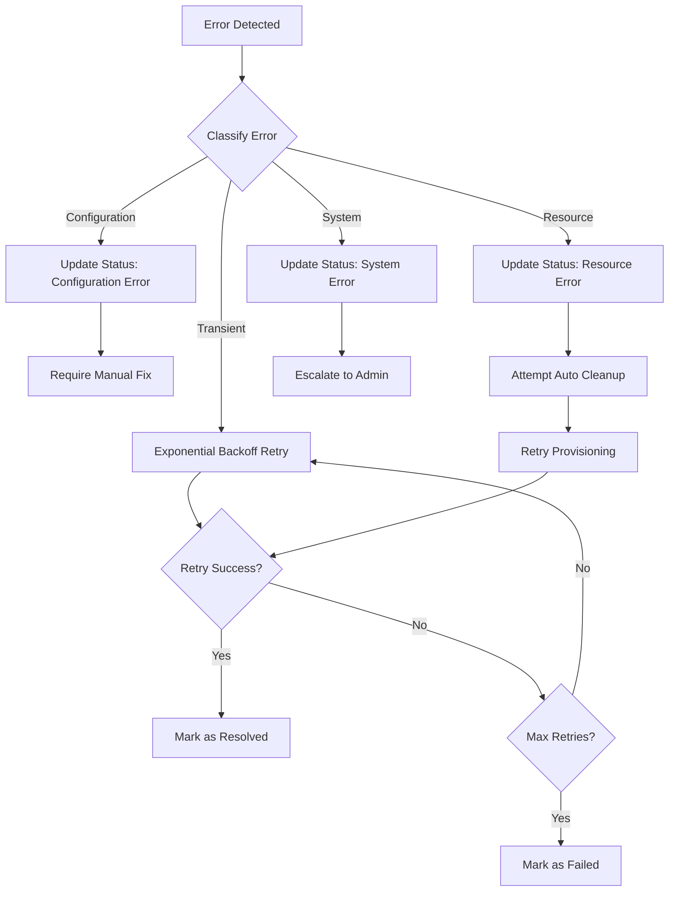

# Component Architecture

This document details the internal components and their interactions within the EchoLlama-Echorator system.

## Core Components Overview

## Model Controller Detail

The Model Controller is the heart of the operator, responsible for managing the complete lifecycle of Ollama models.

## Resource Management Architecture

## Component Responsibilities

### Model Controller
- **Primary Function**: Reconcile Model custom resources
- **Key Operations**:
  - Validate model specifications
  - Coordinate image pulling and storage
  - Manage deployment lifecycle
  - Handle scaling operations
  - Monitor health and status
  - Integrate with EchoLlama engine
  - Coordinate with Deep Tree Echo system

### Reconcile Controller
- **Primary Function**: Ensure desired state matches actual state
- **Key Operations**:
  - Continuous reconciliation loops
  - Error recovery mechanisms
  - State drift detection
  - Resource cleanup

### Status Controller
- **Primary Function**: Maintain accurate status information
- **Key Operations**:
  - Health monitoring
  - Metrics collection
  - Status reporting
  - Event generation

### CLI Tools Integration
- **kollama CLI**: User-friendly command-line interface
- **kubectl integration**: Native Kubernetes tooling support

## Inter-Component Communication

## Error Handling and Recovery

This component architecture ensures robust, scalable, and maintainable operations while providing deep integration with the EchoLlama ecosystem and Deep Tree Echo cognitive capabilities.