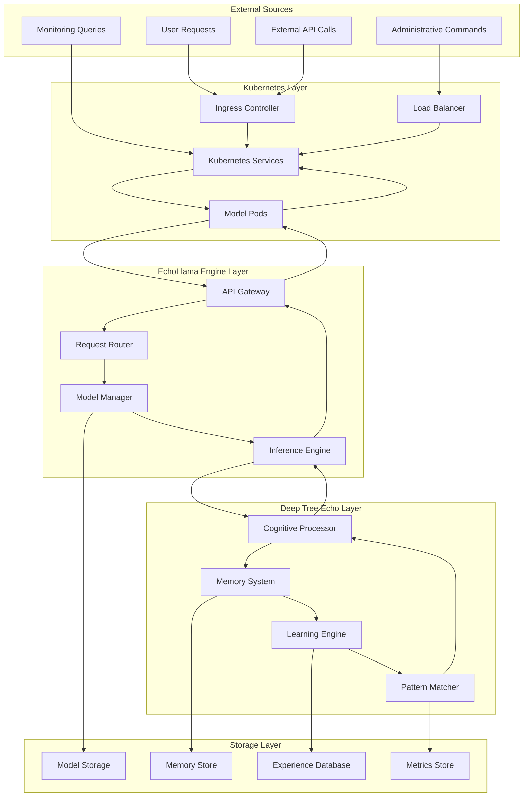
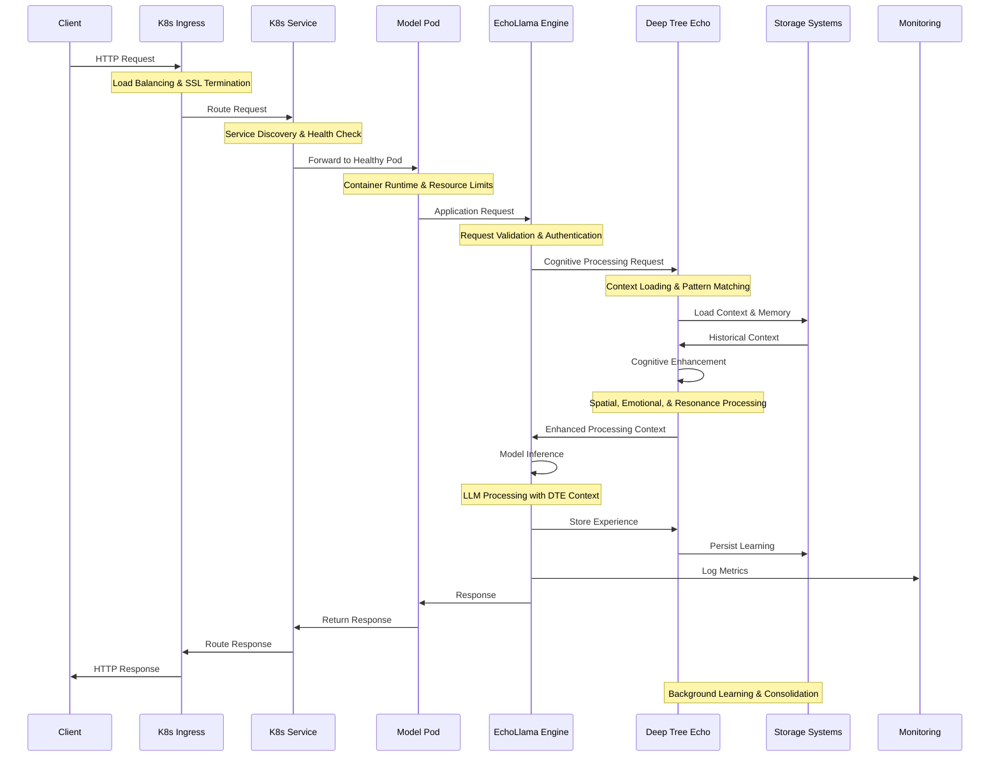
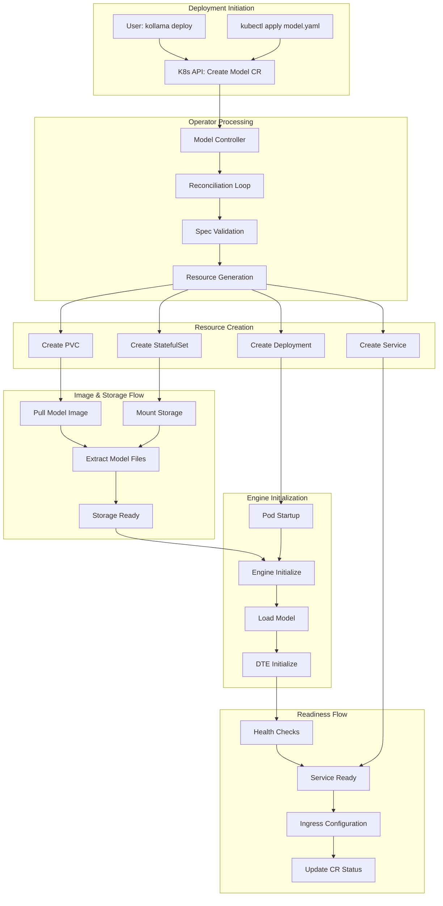
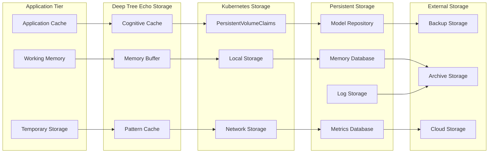
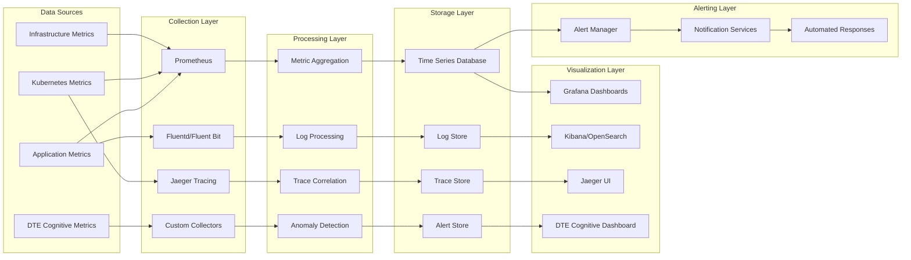
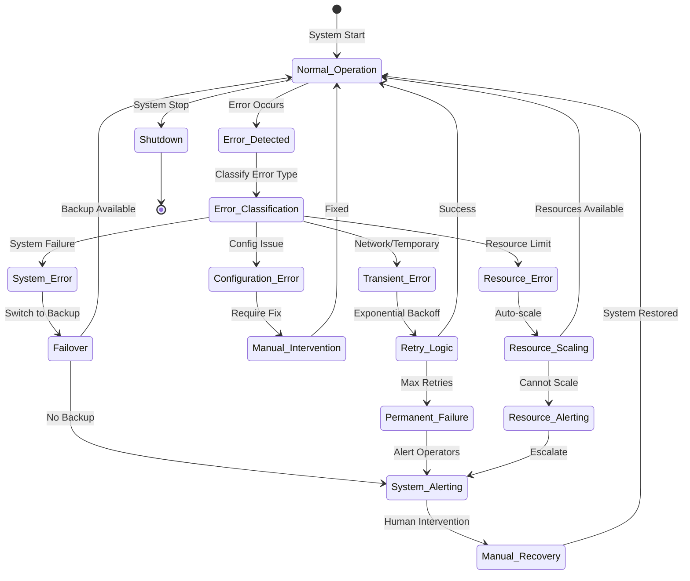

# System Data Flow Architecture

This document details the comprehensive data flow patterns within the EchoLlama-Echorator ecosystem, including interactions between Kubernetes, EchoLlama engine, and Deep Tree Echo cognitive systems.

## High-Level Data Flow Overview

## Request Processing Data Flow

### Complete Request Lifecycle

## Model Management Data Flow

### Model Deployment and Lifecycle

## Deep Tree Echo Cognitive Data Flow

### Cognitive Processing Pipeline

```mermaid
graph TB
    subgraph "Input Processing"
        RAW_INPUT[Raw Input Data]
        TOKENIZATION[Tokenization]
        CONTEXTUALIZATION[Contextualization]
        SPATIAL_MAPPING[Spatial Mapping]
    end
    
    subgraph "Pattern Recognition"
        PATTERN_EXTRACT[Pattern Extraction]
        SIMILARITY_SEARCH[Similarity Search]
        PATTERN_MATCH[Pattern Matching]
        CONFIDENCE_SCORE[Confidence Scoring]
    end
    
    subgraph "Memory Integration"
        SHORT_TERM_ACCESS[Short-term Memory Access]
        LONG_TERM_QUERY[Long-term Memory Query]
        ASSOCIATIVE_RECALL[Associative Recall]
        CONTEXT_BUILDING[Context Building]
    end
    
    subgraph "Cognitive Enhancement"
        EMOTIONAL_COLORING[Emotional Coloring]
        RESONANCE_TUNING[Resonance Tuning]
        COHERENCE_CHECK[Coherence Checking]
        GOAL_ALIGNMENT[Goal Alignment]
    end
    
    subgraph "Response Generation"
        ENHANCED_CONTEXT[Enhanced Context]
        MODEL_INFERENCE[Model Inference]
        POST_PROCESSING[Post-processing]
        RESPONSE_OPTIMIZATION[Response Optimization]
    end
    
    subgraph "Learning & Memory"
        EXPERIENCE_CAPTURE[Experience Capture]
        PATTERN_LEARNING[Pattern Learning]
        MEMORY_CONSOLIDATION[Memory Consolidation]
        FORGETTING_MECHANISM[Selective Forgetting]
    end
    
    RAW_INPUT --> TOKENIZATION
    TOKENIZATION --> CONTEXTUALIZATION
    CONTEXTUALIZATION --> SPATIAL_MAPPING
    
    SPATIAL_MAPPING --> PATTERN_EXTRACT
    PATTERN_EXTRACT --> SIMILARITY_SEARCH
    SIMILARITY_SEARCH --> PATTERN_MATCH
    PATTERN_MATCH --> CONFIDENCE_SCORE
    
    CONFIDENCE_SCORE --> SHORT_TERM_ACCESS
    SHORT_TERM_ACCESS --> LONG_TERM_QUERY
    LONG_TERM_QUERY --> ASSOCIATIVE_RECALL
    ASSOCIATIVE_RECALL --> CONTEXT_BUILDING
    
    CONTEXT_BUILDING --> EMOTIONAL_COLORING
    EMOTIONAL_COLORING --> RESONANCE_TUNING
    RESONANCE_TUNING --> COHERENCE_CHECK
    COHERENCE_CHECK --> GOAL_ALIGNMENT
    
    GOAL_ALIGNMENT --> ENHANCED_CONTEXT
    ENHANCED_CONTEXT --> MODEL_INFERENCE
    MODEL_INFERENCE --> POST_PROCESSING
    POST_PROCESSING --> RESPONSE_OPTIMIZATION
    
    RESPONSE_OPTIMIZATION --> EXPERIENCE_CAPTURE
    EXPERIENCE_CAPTURE --> PATTERN_LEARNING
    PATTERN_LEARNING --> MEMORY_CONSOLIDATION
    MEMORY_CONSOLIDATION --> FORGETTING_MECHANISM
    
    FORGETTING_MECHANISM --> LONG_TERM_QUERY
    PATTERN_LEARNING --> PATTERN_EXTRACT
```

## Storage Data Flow Patterns

### Multi-tier Storage Architecture

## Monitoring and Metrics Data Flow

### Observability Data Pipeline

## Error Handling and Recovery Data Flow

### Error Propagation and Recovery

This comprehensive data flow architecture ensures efficient, reliable, and observable data movement throughout the EchoLlama-Echorator ecosystem while maintaining the sophisticated cognitive capabilities of the Deep Tree Echo system.