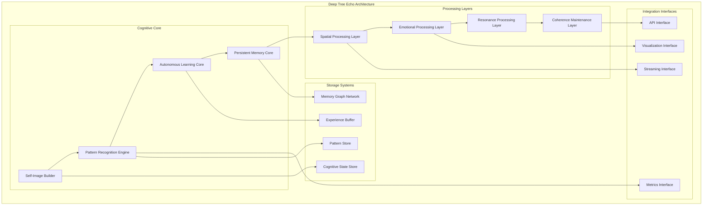
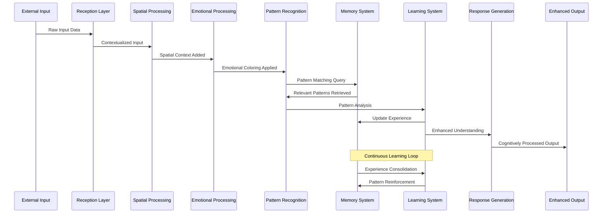
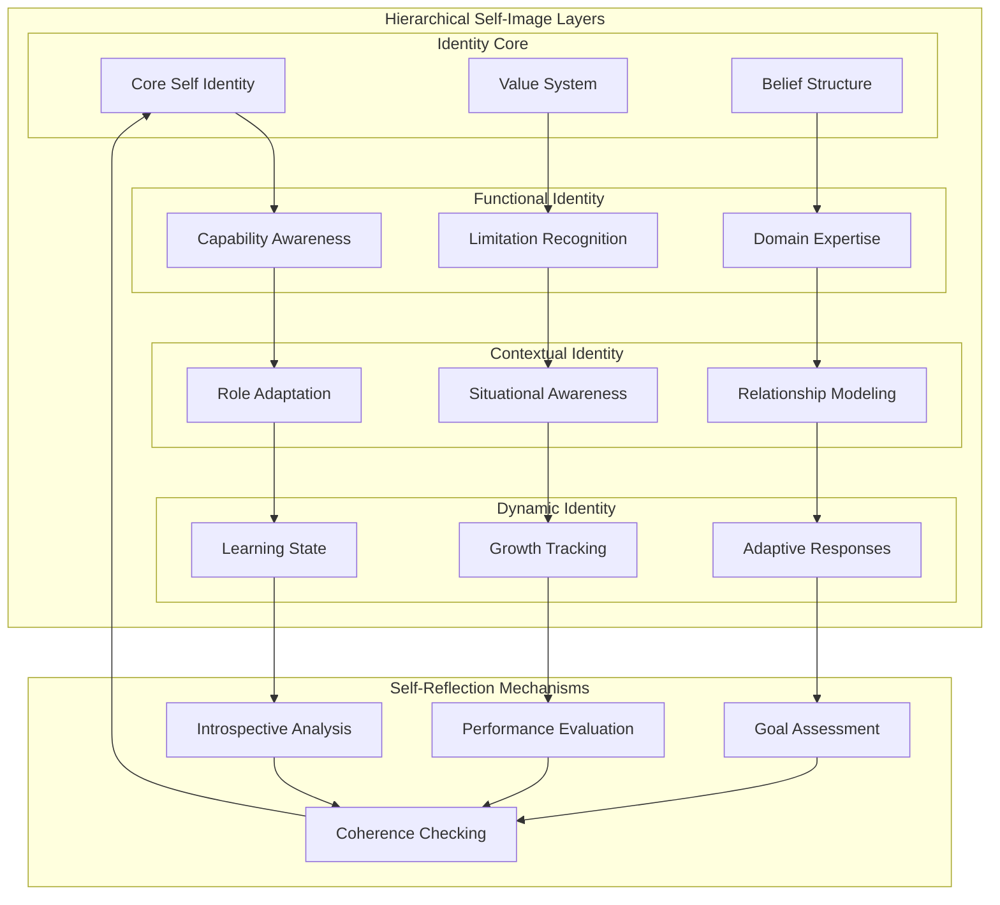
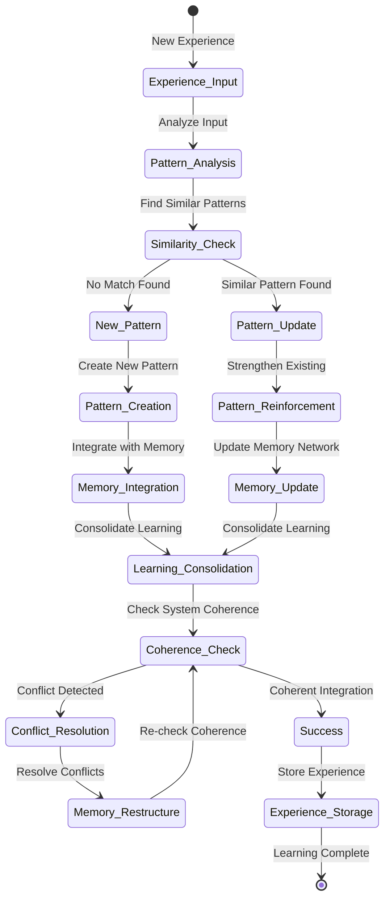
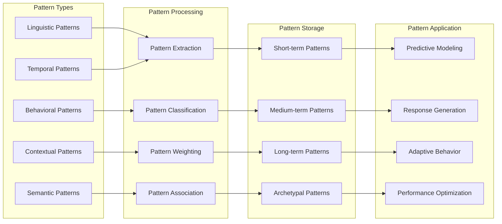
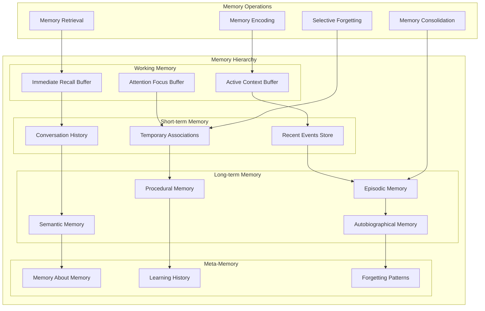
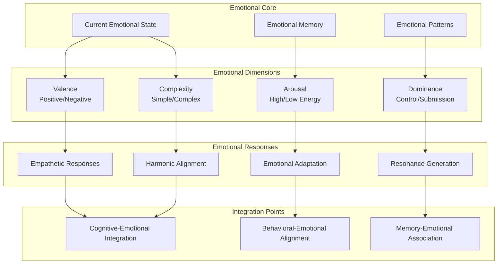
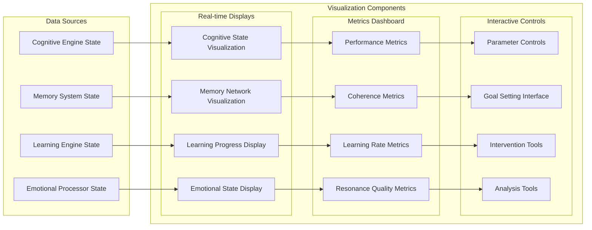
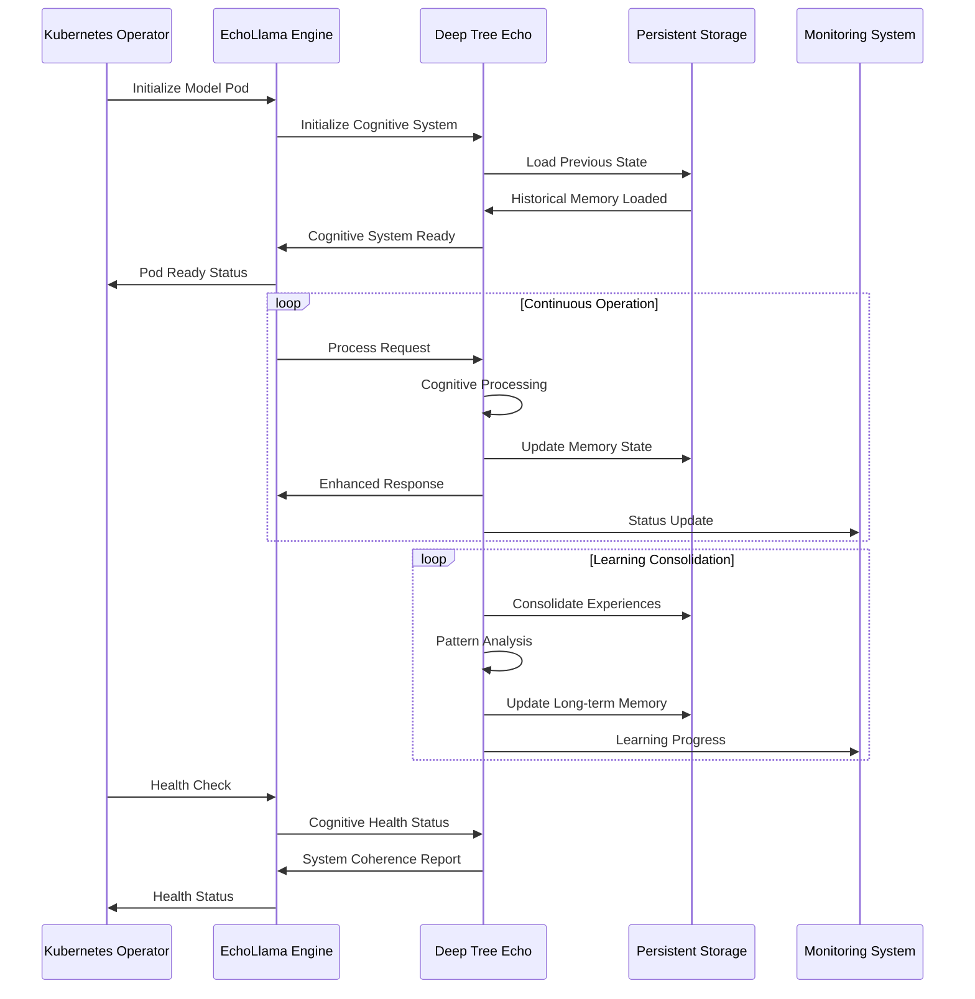

# Deep Tree Echo Identity System Integration

This document details the Deep Tree Echo (DTE) hierarchical self-image building cognitive system and its integration within the EchoLlama-Echorator architecture.

## Deep Tree Echo Overview

Deep Tree Echo represents an advanced cognitive architecture that implements hierarchical self-image building systems with autonomous learning, pattern recognition, and persistent memory capabilities.

## Cognitive Processing Pipeline

### Information Flow Through DTE Layers

## Hierarchical Self-Image Building System

### Self-Image Architecture

## Autonomous Learning System

### Learning Mechanisms

### Pattern Recognition Network

## Memory System Architecture

### Persistent Memory Network

## Emotional and Resonance Processing

### Emotional Processing Architecture

## Real-time Visualization and Monitoring

### Cognitive State Visualization

## Integration with EchoLlama-Echorator

### Operational Integration

This Deep Tree Echo integration provides the EchoLlama-Echorator system with advanced cognitive capabilities, autonomous learning, and hierarchical self-awareness, creating a truly intelligent and adaptive AI infrastructure.