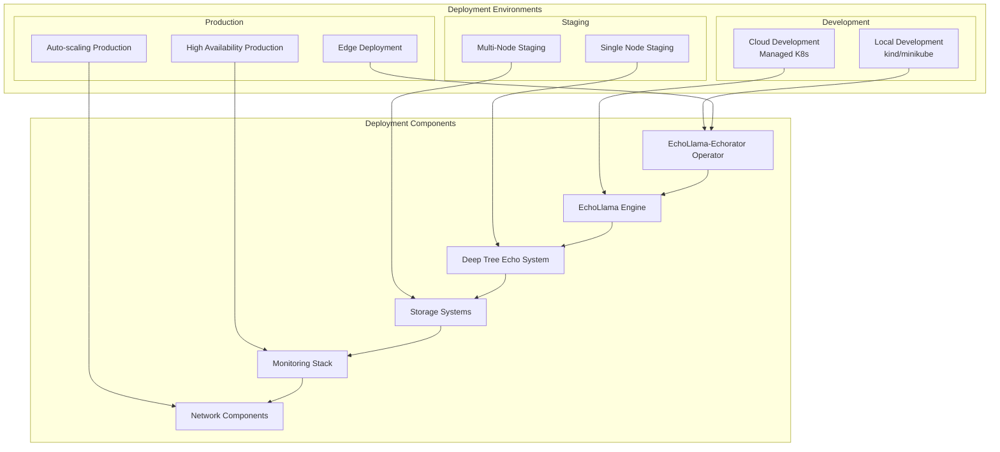
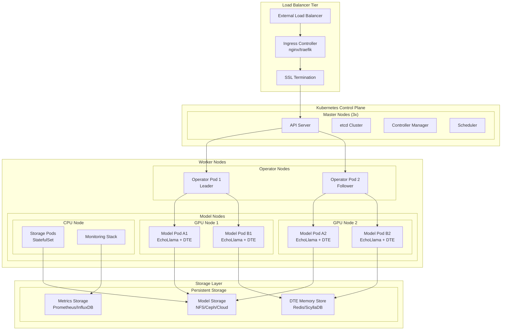
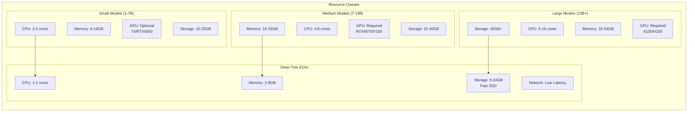
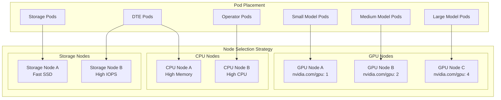
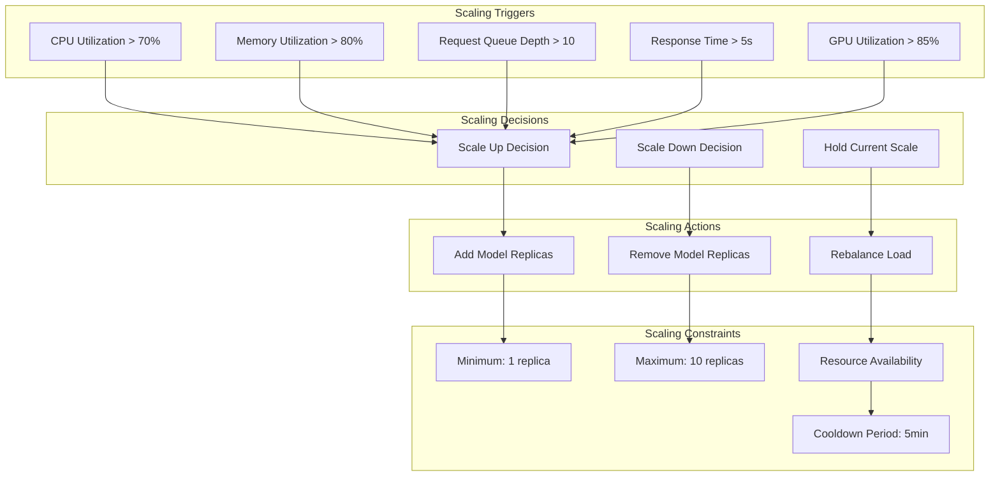
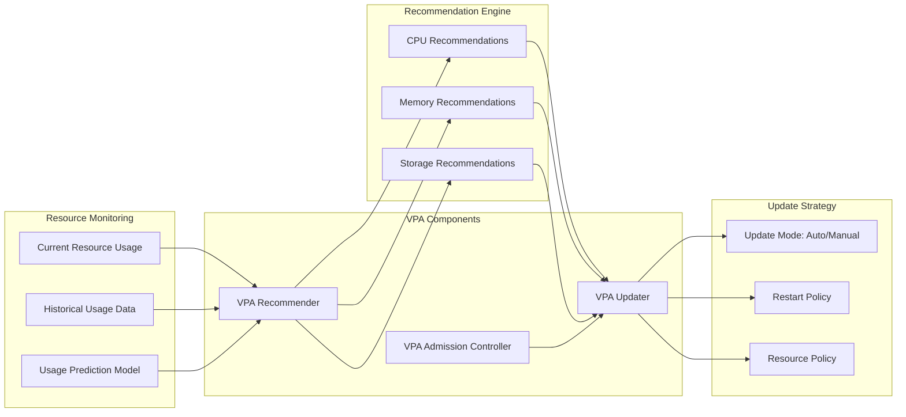
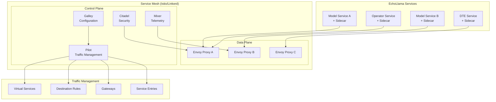
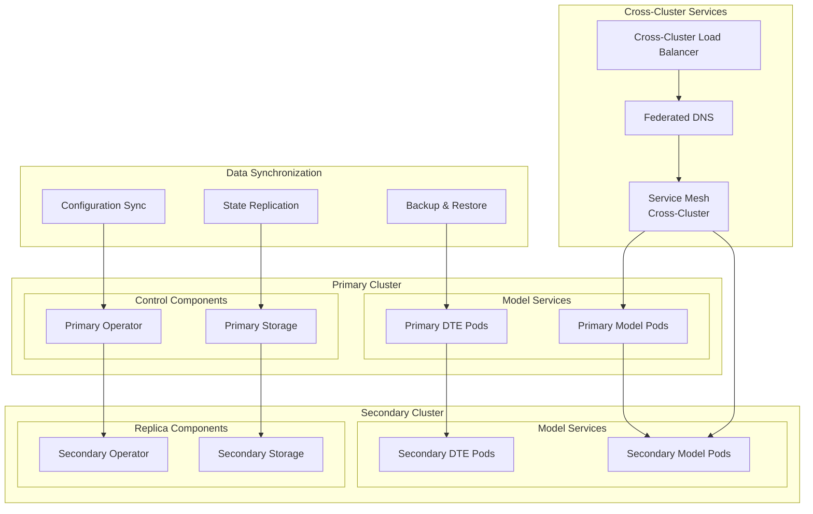
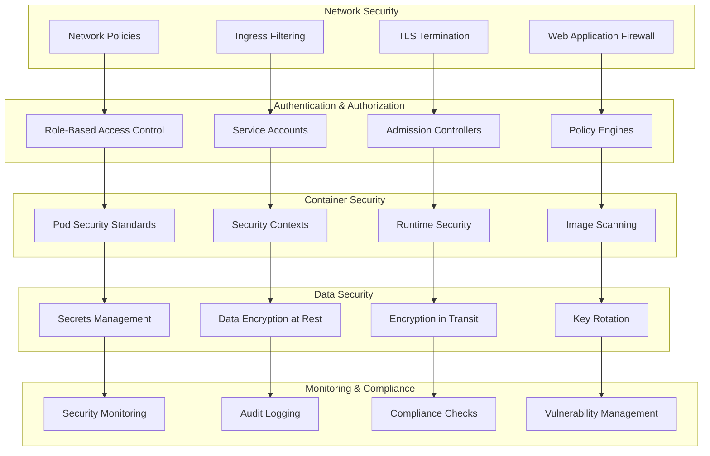
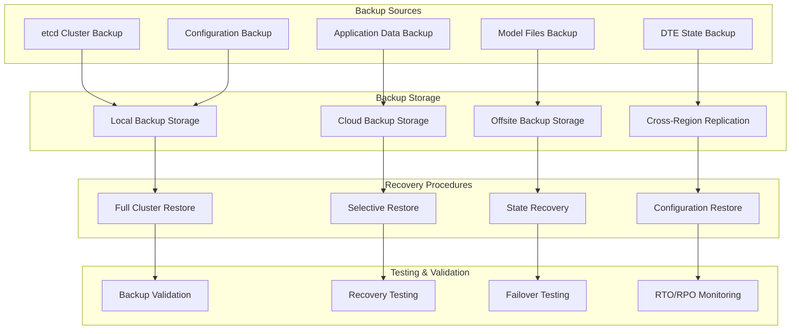

# Deployment Architecture

This document details the deployment strategies, patterns, and configurations for the EchoLlama-Echorator ecosystem across different environments and use cases.

## Deployment Overview

EchoLlama-Echorator supports multiple deployment patterns, from development environments to enterprise-scale production clusters, with full integration of EchoLlama engine and Deep Tree Echo cognitive systems.

## Standard Deployment Architecture

### Production High-Availability Setup

## Resource Allocation Patterns

### Pod Resource Configuration

### Node Affinity and Scheduling

## Scaling Strategies

### Horizontal Pod Autoscaling

### Vertical Pod Autoscaling

## Network Architecture

### Service Mesh Integration

### Multi-Cluster Deployment

## Security Architecture

### Security Layers and Controls

## Disaster Recovery and Backup

### Backup and Recovery Strategy

This comprehensive deployment architecture ensures robust, scalable, and secure deployment of the EchoLlama-Echorator system across various environments while maintaining the advanced cognitive capabilities of the Deep Tree Echo system.