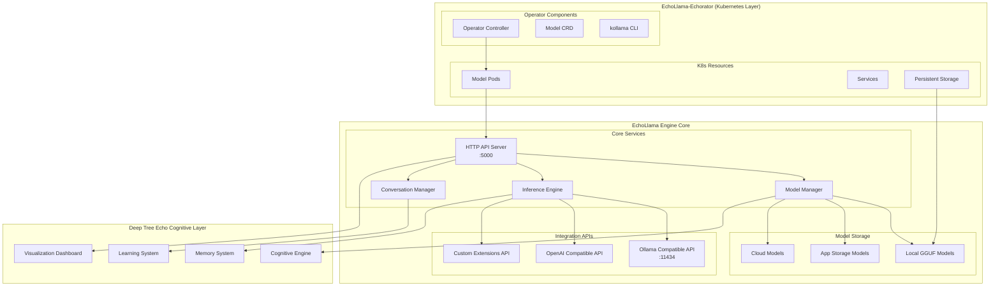
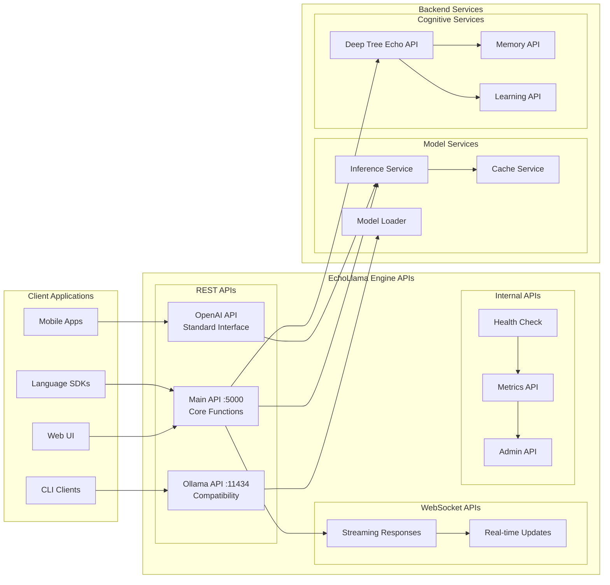
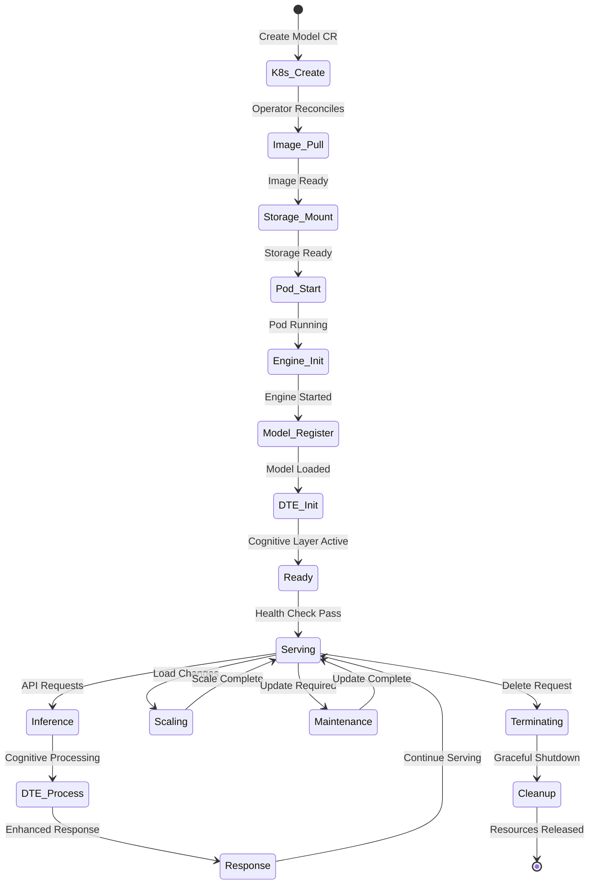
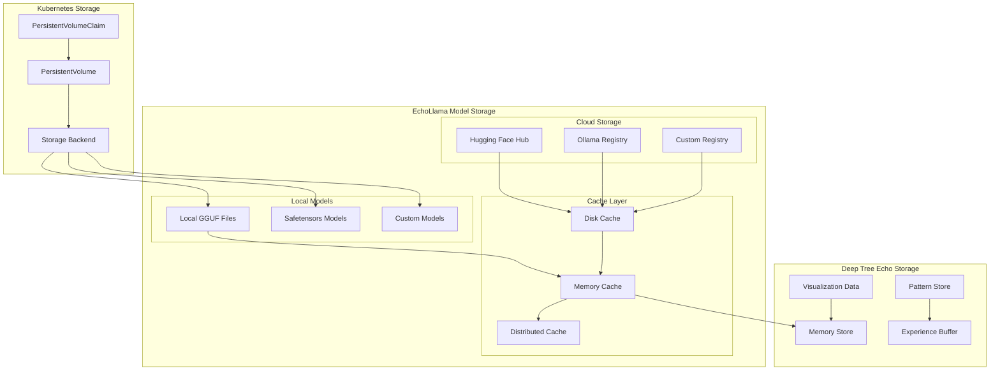
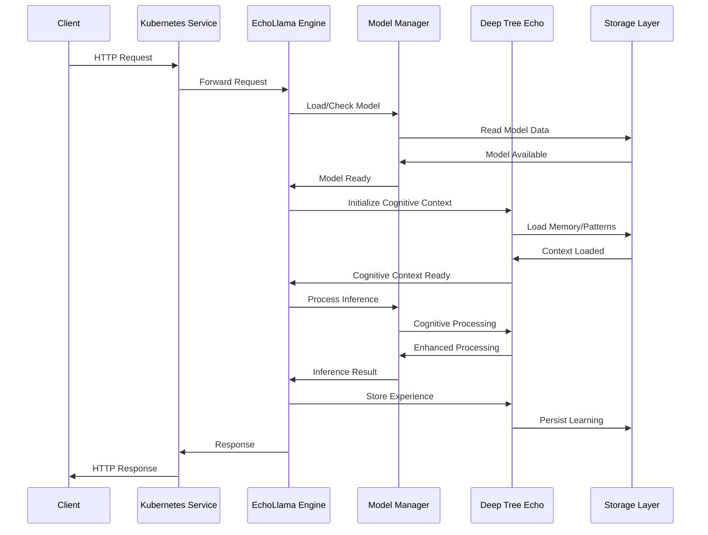
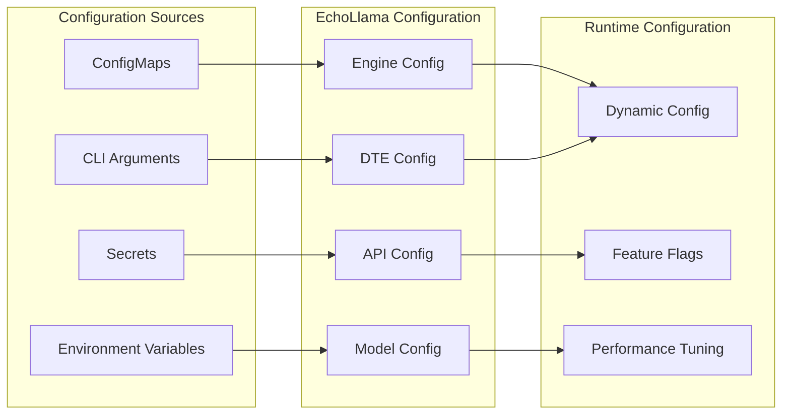
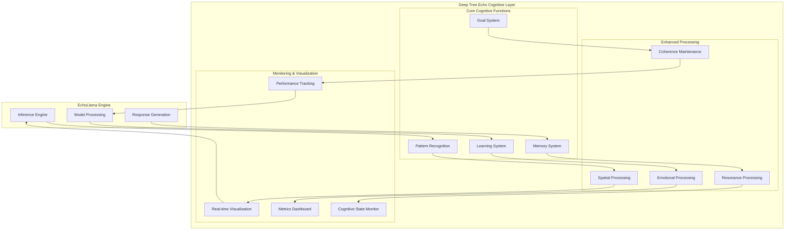

# EchoLlama Engine Integration Architecture

This document details the integration architecture between EchoLlama-Echorator and the EchoLlama engine ecosystem.

## Integration Overview

EchoLlama-Echorator serves as the Kubernetes orchestration layer for the EchoLlama engine, providing cloud-native deployment, scaling, and management capabilities while maintaining deep integration with the core engine features.



## API Integration Points

### Primary Integration Interfaces



## Model Management Integration

### Model Lifecycle in Kubernetes



### Model Storage Integration



## Service Communication Patterns

### Inter-Service Communication



### Configuration Management



## Integration with Deep Tree Echo

### Cognitive Layer Integration



## Health Check and Monitoring Integration

```mermaid
graph LR
    subgraph "Kubernetes Health Checks"
        LIVENESS[Liveness Probe]
        READINESS[Readiness Probe]
        STARTUP[Startup Probe]
    end
    
    subgraph "EchoLlama Health Endpoints"
        ENGINE_HEALTH[/health]
        MODEL_HEALTH[/models/health]
        API_HEALTH[/api/health]
        DTE_HEALTH[/dte/health]
    end
    
    subgraph "Deep Tree Echo Status"
        COGNITIVE_STATUS[Cognitive Status]
        MEMORY_STATUS[Memory Status]
        LEARNING_STATUS[Learning Status]
        COHERENCE_STATUS[Coherence Status]
    end
    
    subgraph "Metrics Collection"
        PROMETHEUS[Prometheus Metrics]
        CUSTOM_METRICS[Custom Metrics]
        PERFORMANCE[Performance Metrics]
    end
    
    LIVENESS --> ENGINE_HEALTH
    READINESS --> MODEL_HEALTH
    STARTUP --> API_HEALTH
    
    ENGINE_HEALTH --> COGNITIVE_STATUS
    MODEL_HEALTH --> MEMORY_STATUS
    API_HEALTH --> LEARNING_STATUS
    DTE_HEALTH --> COHERENCE_STATUS
    
    COGNITIVE_STATUS --> PROMETHEUS
    MEMORY_STATUS --> CUSTOM_METRICS
    LEARNING_STATUS --> PERFORMANCE
```

This integration architecture ensures seamless operation between Kubernetes orchestration and the sophisticated EchoLlama engine with its Deep Tree Echo cognitive capabilities, providing a robust, scalable, and intelligent LLM platform.