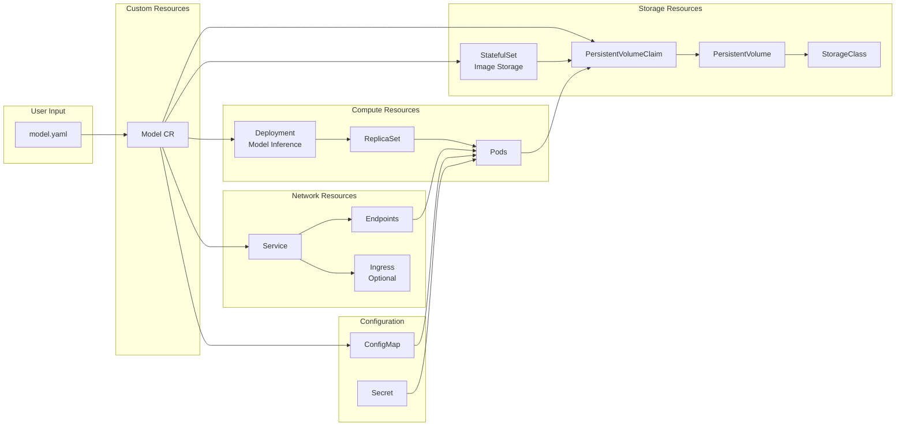
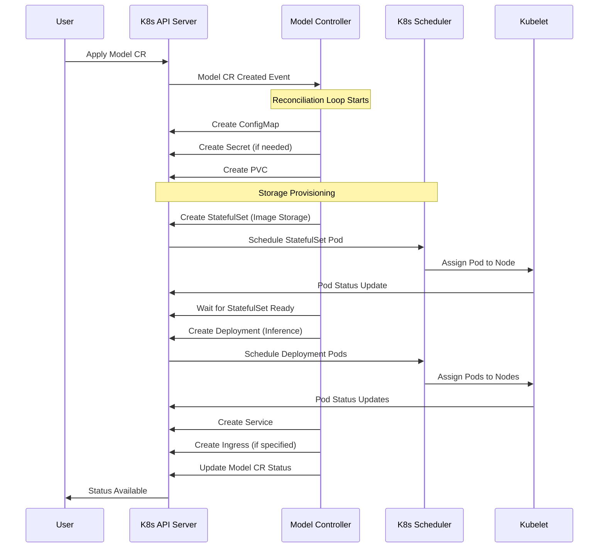
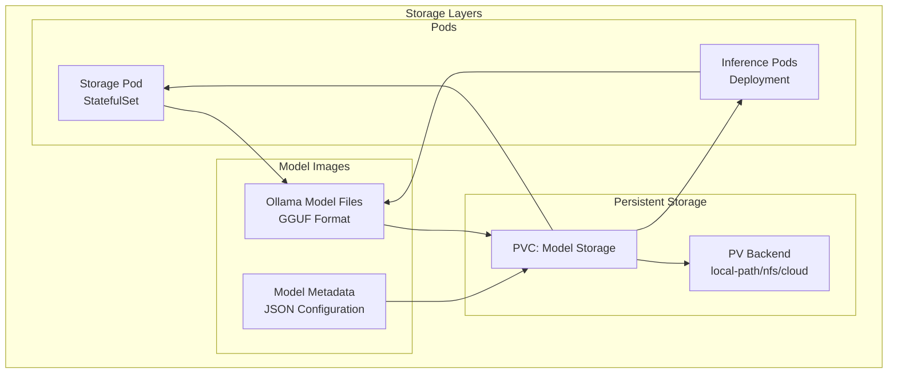
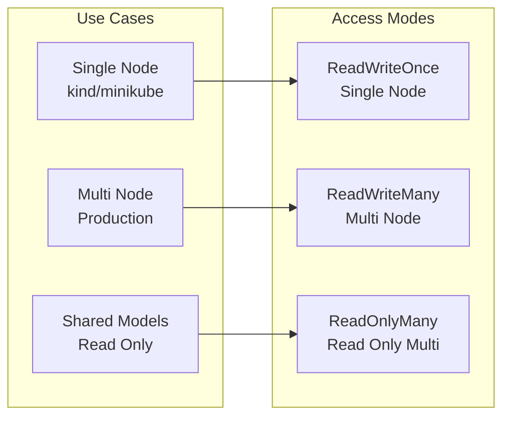
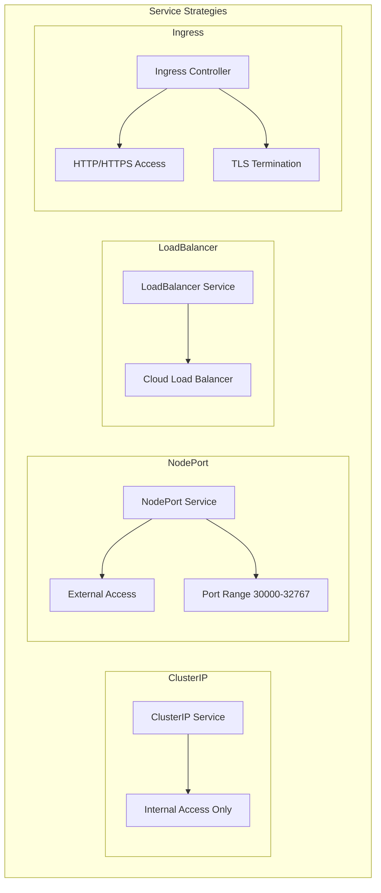
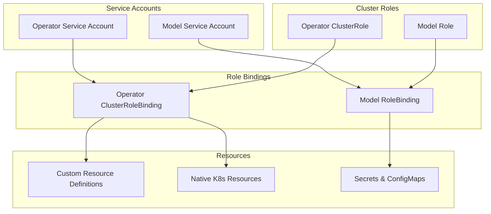
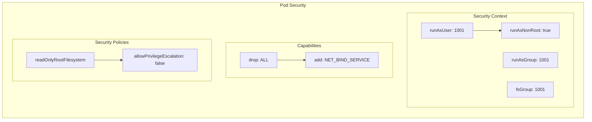
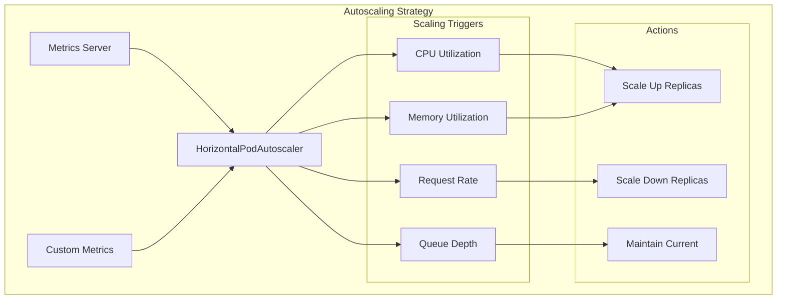
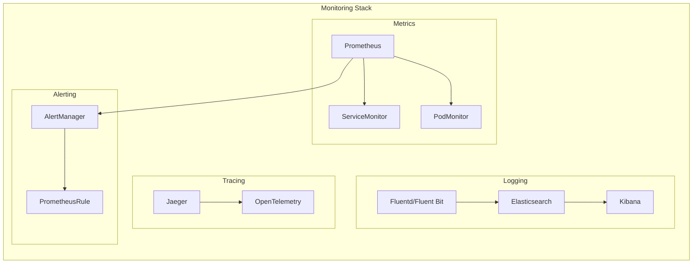

# Kubernetes Resources Architecture

This document details the Kubernetes resources created and managed by the EchoLlama-Echorator operator.

## Custom Resource Definitions (CRDs)

### Model CRD

The Model CRD is the primary interface for users to define and manage Ollama model deployments.

```mermaid
graph TD
    subgraph "Model CRD Structure"
        MODEL[Model Resource] --> SPEC[spec]
        MODEL --> STATUS[status]
        MODEL --> METADATA[metadata]
        
        SPEC --> REPLICAS[replicas: int32]
        SPEC --> IMAGE[image: string]
        SPEC --> PULL_POLICY[imagePullPolicy: string]
        SPEC --> STORAGE_CLASS[storageClassName: string]
        SPEC --> PVC_NAME[persistentVolumeClaim: string]
        SPEC --> PV_SPEC[persistentVolume: PVSpec]
        
        PV_SPEC --> ACCESS_MODE[accessMode: AccessMode]
        
        STATUS --> CONDITIONS[conditions: []Condition]
        STATUS --> READY_REPLICAS[readyReplicas: int32]
        STATUS --> AVAILABLE_REPLICAS[availableReplicas: int32]
        STATUS --> PHASE[phase: string]
        STATUS --> MESSAGE[message: string]
    end
```

### Model Resource Relationships



## Resource Creation Sequence



## Storage Architecture

### Persistent Volume Strategy



### Access Patterns



## Network Architecture

### Service Types and Exposure



## RBAC and Security

### Permission Model



### Security Contexts



## Resource Scaling and Management

### Horizontal Pod Autoscaler Integration



## Monitoring and Observability Resources



This comprehensive Kubernetes resources architecture ensures proper resource management, security, scalability, and observability for the EchoLlama-Echorator operator ecosystem.