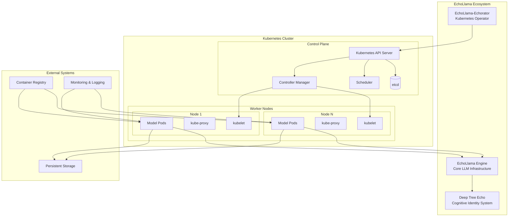

# Technical Architecture Overview

This document provides a comprehensive overview of the EchoLlama-Echorator technical architecture, including its integration with the EchoLlama engine and Deep Tree Echo identity system.

## System Overview

EchoLlama-Echorator is a Kubernetes operator designed to manage and orchestrate Ollama-based large language models at scale, with deep integration into the EchoLlama ecosystem and Deep Tree Echo cognitive architecture.

## Key Components

### 1. EchoLlama-Echorator Operator
- **Purpose**: Kubernetes-native orchestration of Ollama LLM deployments
- **Language**: Go (Kubebuilder framework)
- **Core Responsibilities**:
  - Model lifecycle management
  - Resource provisioning and scaling
  - Integration with EchoLlama engine
  - Deep Tree Echo cognitive layer coordination

### 2. EchoLlama Engine Integration
- **Repository**: [github.com/EchoCog/echollama](https://github.com/EchoCog/echollama)
- **Role**: Core LLM infrastructure providing:
  - Multi-model support (GGUF, Safetensors)
  - RESTful API endpoints
  - Local and cloud model management
  - Real-time inference capabilities

### 3. Deep Tree Echo Identity System
- **Nature**: Hierarchical self-image building cognitive system
- **Capabilities**:
  - Advanced learning and pattern recognition
  - Persistent memory across sessions
  - Real-time visualization and monitoring
  - Goal-oriented cognition
  - Emotional and spatial processing

## Architecture Principles

1. **Cloud-Native Design**: Built for Kubernetes environments with operator patterns
2. **Cognitive Integration**: Deep integration with Deep Tree Echo identity system
3. **Scalability**: Horizontal scaling of model instances across cluster nodes
4. **Observability**: Comprehensive monitoring and logging capabilities
5. **Flexibility**: Support for various model formats and deployment patterns

## Next Steps

- [Component Diagrams](./components.md) - Detailed component interaction diagrams
- [Kubernetes Resources](./kubernetes-resources.md) - CRD and resource relationships
- [EchoLlama Integration](./echollama-integration.md) - Engine integration architecture
- [Deep Tree Echo](./deep-tree-echo.md) - Cognitive identity system integration
- [Data Flow](./data-flow.md) - System data flow and processing
- [Deployment](./deployment.md) - Deployment architecture and patterns